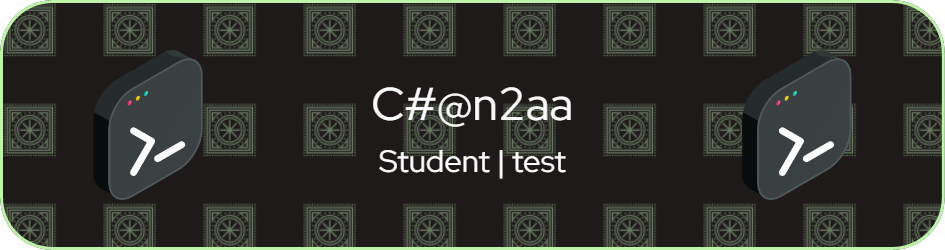

# 👋 Hi, I’m @Chanzaa 

- 👀 I’m interested in Backend Development
- 🌱 I’m currently learning **Laravel & Flutter**

#### Skills

  

#### Connect with me 

 

#### Play Games with me

<!-- <picture>
  <source media="(prefers-color-scheme: dark)" srcset="https://raw.githubusercontent.com/Chanzaa/Chanzaa/output/pacman-contribution-graph-dark.svg">
  <source media="(prefers-color-scheme: light)" srcset="https://raw.githubusercontent.com/Chanzaa/Chanzaa/output/pacman-contribution-graph.svg">
  
</picture> -->
###

###

#### My Github Stats

